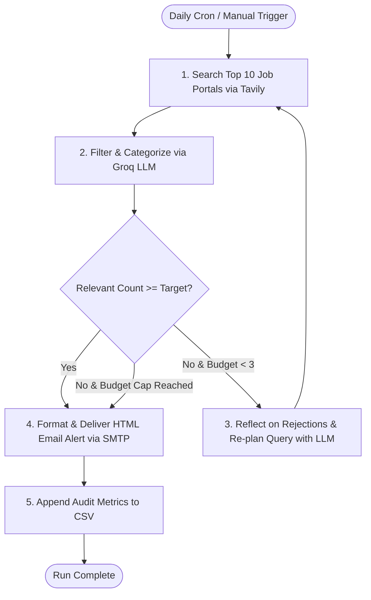

# 🤖 Autonomous Tech & AI/ML Job Alert Agent

An autonomous Python AI agent that proactively searches, filters, reflects, re-plans, and emails daily alerts for high-relevance tech internships (**AI/ML, Deep Learning, Software Engineering / SDE, Data Science**) across the **Top 10 job platforms**.

---

## 🎯 Architecture & Workflow



---

## 🧠 Why This is an "Agent" (Interview Talking Points)

| Feature | Ordinary Script | Autonomous Agent (This Project) |
|---|---|---|
| **Execution** | Runs a single hardcoded search once and terminates. | Executes an **autonomous perception & action loop**. |
| **Quality Evaluation** | Returns whatever raw results the search engine gives. | Uses an LLM to evaluate relevance against 4 strict criteria and classifies domain tags. |
| **Failure Handling** | Fails or returns 0 results if the query was slightly off. | **Reflects** on why results failed, re-formulates a smarter query, and re-searches. |
| **Safety Guardrail** | Can recurse infinitely or exhaust API limits. | Enforces a strict **Hard Budget Cap (max 3 searches)** to guarantee predictable costs. |
| **Fault Tolerance** | Crashes on 429 rate-limits or transient timeouts. | Implements **exponential backoff retry logic** across search and LLM calls. |
| **Observability** | Console printouts only. | Maintains an append-only audit trail in [`agent_runs.csv`](agent_runs.csv). |

---

## 🌐 Top 10 Curated Platforms Targeted

The agent restricts its web search queries to verified, high-signal platforms to eliminate course promotions and blog noise:
1. **LinkedIn Jobs** (`linkedin.com/jobs`)
2. **Wellfound / AngelList** (`wellfound.com`)
3. **Y Combinator - Work at a Startup** (`ycombinator.com/jobs`)
4. **Internshala** (`internshala.com`)
5. **Instahyre** (`instahyre.com`)
6. **Cuvette** (`cuvette.tech`)
7. **Unstop** (`unstop.com`)
8. **Indeed India** (`indeed.co.in`)
9. **Greenhouse ATS** (`boards.greenhouse.io`)
10. **Lever ATS** (`jobs.lever.co`)

---

## 🚀 Setup & Local Execution

### 1. Clone & Install Dependencies
```bash
git clone <your-repo-url>
cd AGENTIC_AI
pip install -r requirements.txt
```

### 2. Configure Environment (`.env`)
Create a `.env` file based on `.env.example`:
```env
# Tavily Search API Key (Free tier at https://app.tavily.com)
TAVILY_API_KEY=tvly-xxxxxxxxxxxxxxxxxxxx

# Groq API Key (Free tier at https://console.groq.com)
GROQ_API_KEY=gsk_xxxxxxxxxxxxxxxxxxxx
GROQ_MODEL=openai/gpt-oss-20b

# Email Delivery (Gmail SMTP)
SMTP_SERVER=smtp.gmail.com
SMTP_PORT=465
EMAIL_SENDER=your_email@gmail.com
EMAIL_PASSWORD=your_16_char_app_password
EMAIL_RECIPIENT=destination_email@gmail.com
```

> **Note on Gmail:** Generate a 16-character **App Password** under *Google Account > Security > 2-Step Verification > App Passwords*.

### 3. Run Locally
```bash
python job_agent.py
```

---

## ⏰ Cloud Deployment with GitHub Actions (Stage 7)

The workflow file [`.github/workflows/daily_job_agent.yml`](.github/workflows/daily_job_agent.yml) runs the agent automatically every morning at **03:00 UTC (8:30 AM IST)**.

### How to Configure GitHub Secrets:
1. Push your code to a GitHub repository (ensure `.env` is ignored by `.gitignore`).
2. Go to **Settings > Secrets and variables > Actions > New repository secret**.
3. Add the following secrets:
   - `TAVILY_API_KEY`: Your Tavily API key.
   - `GROQ_API_KEY`: Your Groq API key.
   - `GROQ_MODEL`: `openai/gpt-oss-20b` (or `llama-3.1-8b-instant`).
   - `EMAIL_SENDER`: Your sender Gmail address.
   - `EMAIL_PASSWORD`: Your 16-character Gmail App Password.
   - `EMAIL_RECIPIENT`: Your recipient email address.

### Manual 1-Click Run in GitHub:
Go to the **Actions** tab in your GitHub repository &rarr; select **Daily Job Alert Agent** &rarr; click **Run workflow**.
